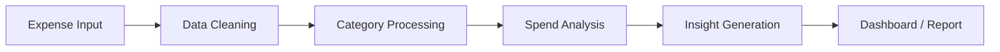

# SpendSmart AI Expense Intelligence System


SpendSmart is an AI-powered expense intelligence system designed to help users understand spending patterns, identify financial habits, and make better money decisions from expense data.

The project focuses on practical expense analysis, clean data handling, and intelligent insights that turn raw transaction records into useful summaries.

---

## Problem Statement

Most people track expenses only after money is already spent. Raw expense data is difficult to understand because it is scattered across categories, dates, merchants, and payment patterns.

SpendSmart solves this by converting expense records into clear insights so users can quickly answer questions like:

- Where is most of my money going?
- Which categories are increasing month by month?
- What expenses look unusual?
- How can I improve my spending habits?

## Solution

SpendSmart analyzes expense data and presents structured financial intelligence. It helps users move from basic tracking to smarter decision-making by combining expense categorization, summaries, trends, and AI-assisted interpretation.

## Key Features

- Add and manage expense records
- Categorize transactions by spending type
- View total spending and category-wise summaries
- Identify high-spend areas
- Detect unusual or repeated spending behavior
- Generate simple financial insights from expense data
- Present information in a clean, user-friendly format

## Tech Stack

| Area | Tools |
| --- | --- |
| Programming | Python |
| Data Handling | Pandas / CSV-based workflows |
| Interface | Streamlit or web UI |
| Intelligence Layer | Rule-based insights / AI-ready analysis |
| Version Control | Git + GitHub |

## System Workflow



## Project Structure

```text
SpendSmart-AI-Expense-Intelligence-System/
├── README.md
├── requirements.txt
├── app.py
├── data/
│   └── sample_expenses.csv
├── src/
│   ├── analysis.py
│   ├── insights.py
│   └── utils.py
├── assets/
│   └── screenshots/
└── docs/
    └── architecture.md
```

## Installation

```bash
git clone https://github.com/nreddie7702/SpendSmart-AI-Expense-Intelligence-System.git
cd SpendSmart-AI-Expense-Intelligence-System
python -m venv .venv
.venv\Scripts\activate
pip install -r requirements.txt
```

For macOS/Linux:

```bash
source .venv/bin/activate
```

## Usage

If the project uses Streamlit:

```bash
streamlit run app.py
```

If the project is script-based:

```bash
python app.py
```

## Screenshots

Add screenshots here after running the app:

| Dashboard | Category Insights |
| --- | --- |
| `assets/screenshots/dashboard.png` | `assets/screenshots/category-insights.png` |

## What This Project Demonstrates

- Python programming fundamentals
- Data cleaning and transformation
- Expense analysis logic
- Product thinking for personal finance use cases
- Ability to present technical work in a recruiter-friendly way
- Foundation for adding AI-powered financial recommendations

## Future Improvements

- Add user authentication
- Store expenses in PostgreSQL
- Add monthly budget recommendations
- Add AI-generated spending summaries
- Add charts for monthly and category trends
- Add exportable PDF reports
- Deploy the app online

## Author

**Lakshmi Narasimha Reddy Bolla**  
AI Engineer Fresher

[](https://github.com/nreddie7702)
[](https://www.linkedin.com/in/narasimhareddy-ai/)
[](mailto:narasimhabolla6789@gmail.com)
